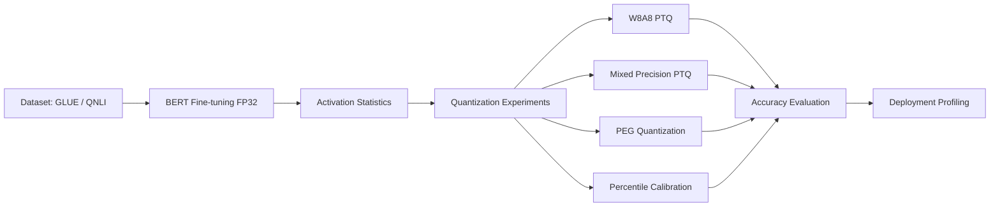

# Transformer Quantization: Activation Outliers Analysis

Reproducible research and system-level experiments investigating **failure modes in post-training quantization (PTQ) of transformer models**.

This project reproduces and extends the findings from:

**Bondarenko et al., "Understanding and Overcoming the Challenges of Efficient Transformer Quantization", EMNLP 2021 (Qualcomm AI Research)**  
https://arxiv.org/abs/2109.12948

This is my code for my accompanying research paper:

**Activation Outliers in Transformer Quantization: Reproduction, Statistical Analysis, and Deployment Tradeoffs**  
https://arxiv.org/abs/2603.04308

---

# Key Results

Experiments on **BERT-base fine-tuned on QNLI** show that naive transformer quantization fails due to **structured activation outliers**.

| Method | Accuracy |
|------|------|
| FP32 baseline | 89.66% |
| W8A8 PTQ | 54.33% |
| Mixed Precision PTQ | 89.42% |
| PEG Quantization | 86.18% |
| Percentile Calibration | ~50% |

Key observations:

- Transformer activations show **extreme heavy-tailed distributions**
- Kurtosis reaches **271 in later layers**
- **55% of activation energy lies in the top 1% of channels**
- Outliers are **structured signal**, not random noise

These findings confirm that transformer PTQ failures are caused by **channel dominance amplified through residual connections**.

---

# System Architecture

The experimental pipeline:



---

# Repository Structure

```
transformer-quantization/
│
├── main.py
├── quantization/
├── models/
├── datasets/
├── runs/
├── paper/
│
├── run_oneclick.sh
├── run_oneclick.bat
├── requirements.txt
└── README.md
```

---

# Installation

Requirements

- Python ≥ 3.6
- PyTorch 1.4
- CUDA 10.0

Install dependencies:

```bash
pip install -r requirements.txt
```

Add project to Python path:

```bash
export PYTHONPATH="${PYTHONPATH}:/path/to/repo"
```

---

# Running Experiments

## Train FP32 baseline

```
python main.py train-baseline \
--model-name bert_base_uncased \
--task qnli \
--learning-rate 3e-5 \
--batch-size 8 \
--num-epochs 3
```

## Run standard PTQ experiment

```
python main.py validate-quantized \
--weight-quant \
--act-quant \
--n-bits 8 \
--n-bits-act 8 \
--task qnli
```

---

# Quantization Methods Implemented

### Standard W8A8 PTQ
Naive symmetric weight + asymmetric activation quantization.

### Mixed Precision PTQ
Critical residual pathways kept at **16-bit precision**.

### PEG Quantization
Per-embedding-group activation quantization to mitigate structured outliers.

### AdaRound PTQ
Ultra-low bit quantization with learned rounding.

### Quantization-Aware Training
Fine-tuning models with quantization simulation during training.

---

# Deployment Profiling

Models were profiled on **RTX 3050 GPU**.

| Metric | Value |
|------|------|
| Median Latency | ~58–59 ms |
| VRAM Usage | ~484–486 MB |

Accuracy differences dominate deployment tradeoffs, while runtime differences remain small.

---

# Why This Matters

Efficient transformer quantization is critical for:

- **Edge AI**
- **on-device inference**
- **low-power deployment**
- **privacy-preserving ML systems**

Smaller quantized models enable inference **without sending data to cloud servers**.

---

# On-Device Inference Pipeline


---

# Reproduce Everything

Run the full pipeline:

macOS / Linux

```
./run_oneclick.sh
```

Windows

```
run_oneclick.bat
```

Outputs:

```
runs/
runs/results/deploy_profile.csv
runs/results/accuracy_latency_size.png
paper/paper.tex
```

---

# Citation

If you use this repository:

```
@article{kaliaperumal2026activation,
title={Activation Outliers in Transformer Quantization},
author={Kaliaperumal, Pranav},
year={2026},
journal={arXiv preprint arXiv:2603.04308}
}
```

---

# Author

Pranav Kumar Kaliaperumal  
M.S. Computer Science  
University of Colorado Denver  

LinkedIn  
https://www.linkedin.com/in/pranav-kumar-kaliaperumal

GitHub  
https://github.com/pranavkkp4

Paper  
https://arxiv.org/abs/2603.04308
